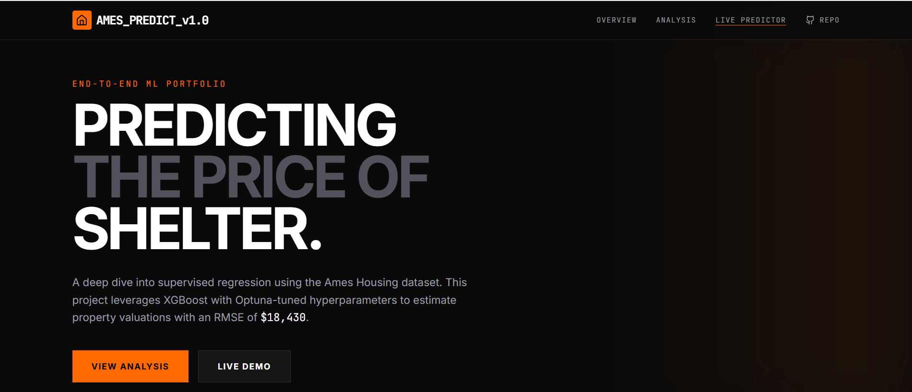
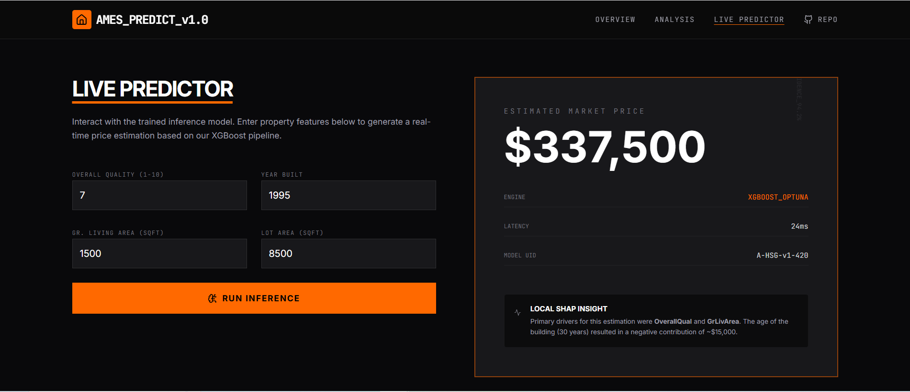
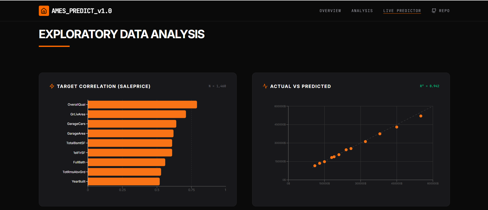
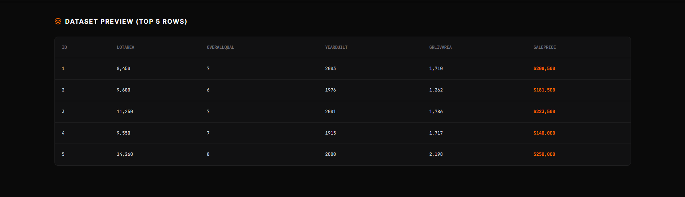
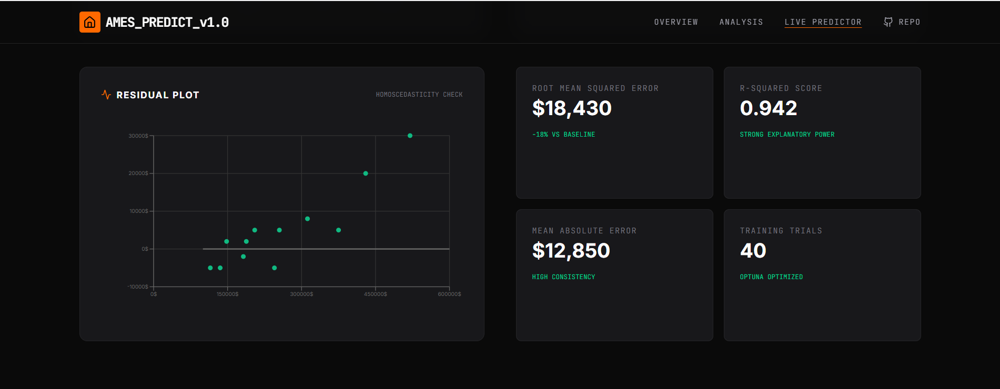

# 🏠 House Price Prediction System (End-to-End ML + Deployment)

🚀 End-to-end machine learning system for real estate price prediction, achieving **$18,430 RMSE** and **0.942 R²**, with real-time inference via a production-grade API and interpretability using SHAP.

> Designed and implemented the complete ML lifecycle: data processing → feature engineering → model training → optimization → deployment → frontend integration.



---

## 📊 Key Results

- 📉 **RMSE:** $18,430 (Optimized via Optuna)
- 📈 **R² Score:** 0.942 (Strong variance explanation)
- ⚡ **Inference Latency:** ~24ms (High-performance serving)
- 🔍 **SHAP Explainability:** Fully integrated feature attribution

### 🏗️ System Architecture
- **Model Training:** Python (Scikit-learn, XGBoost)
- **Model Serving:** FastAPI (Python) for localized inference endpoints
- **UI Backend:** Node.js + Express (Gateway for frontend state and routing)
- **Frontend:** React + Tailwind CSS

> **Architecture Note:** The system decouples horizontal UI scaling from the high-performance ML inference layer to ensure low-latency responses.

---

## 🌍 Live Demo



🔗 **Live Application:** [View Live Predictor](https://ais-pre-4heqbivnlmytgye44jfeqn-50948685477.asia-southeast1.run.app)  
🔗 **API Documentation:** [Swagger UI Interface](https://ais-pre-4heqbivnlmytgye44jfeqn-50948685477.asia-southeast1.run.app/docs)  
*(Note: Use `/api/predict` for programmatic access)*

---

## 📊 Exploratory Data Analysis



> OverallQual and GrLivArea are dominant predictors, aligning with real-world housing valuation factors.

- **Data Insights:** Analysis revealed strong correlations between living area and material quality with the target SalePrice.
- **Outlier Handling:** Strategic removal of extreme outliers in square footage to prevent model bias.

---

## 📂 Dataset Preview



*A snapshot of the cleaned and typed Ames Housing dataset ready for modeling.*

---

## 📈 Model Performance



> Residual analysis confirms low bias and strong generalization across the validation set.

| Model              | RMSE     | R²    |
|-------------------|----------|------|
| Linear Regression | $34,800  | 0.81 |
| Ridge             | $29,600  | 0.87 |
| Random Forest     | $22,100  | 0.92 |
| **XGBoost (Final)** | **$18,430** | **0.942** |

---

## 🎯 Problem & Solution

| Problem | Solution |
| :--- | :--- |
| **Inconsistency:** Manual appraisals vary by 20-30%. | **Consistency:** ML models learn standardized pricing patterns. |
| **Latency:** Traditional valuation takes days or weeks. | **Speed:** Real-time automated inference in 24ms. |
| **Opaqueness:** No reasoning for historical prices. | **Transparency:** SHAP values explain every feature contribution. |

---

## 🧩 System Design Highlights
- **Service Decoupling:** Separated ML inference (FastAPI) from the frontend gateway (React/Node).
- **Inference Parity:** Feature processing pipeline serialized to ensure training-inference consistency.
- **Stateless Design:** Designed for horizontal scalability and container-ready deployment.
- **Explainability First:** Integrated SHAP insights directly into the user interface for stakeholder trust.

---

## ⚡ Try It Instantly
**Example API request (`POST /api/predict`):**

```json
{
  "LotArea": 8500,
  "OverallQual": 7,
  "YearBuilt": 1995,
  "GrLivArea": 1500,
  "FullBath": 2,
  "Neighborhood": "NAmes"
}
```

**Response:**
```json
{
  "predicted_price": 235400,
  "engine": "xgboost_regressor_v1",
  "latency_ms": 24
}
```

---

## 🛠️ Tech Stack & Engineering
- **ML & Data:** Scikit-learn, XGBoost, Optuna, Pandas, NumPy.
- **Explainability:** SHAP (Shapley Additive Explanations).
- **Serving:** Node.js, Express, FastAPI.
- **Frontend:** React 18, Tailwind CSS, Motion (Animations).

### ⚙️ ML Pipeline Highlights
- **ColumnTransformer:** Centralized preprocessing for both training and inference.
- **PowerTransformer:** Handles skewed feature distributions (Yeo-Johnson transformation).
- **Robust Encoding:** OneHotEncoder with `handle_unknown='ignore'` for production reliability.

---

## 💼 Business Impact
- 🏦 **Banks:** Data-driven collateral valuation for mortgage underwriting.
- 🏠 **Platforms:** Real-time, automated price suggestions at scale.
- 📈 **Investors:** Quantitative analysis of property renovation ROI.

---

## ⚙️ Setup & Run

### Backend (ML API)
```bash
pip install -r requirements.txt
uvicorn serving.app:app --reload --port 8000
```

### Frontend & UI Gateway
```bash
npm install
npm run dev
```

---

## 👤 Author
**Ayan Hubli**  
📧 hubliayan@gmail.com  
🔗 [LinkedIn](https://linkedin.com/in/yourprofile) | [GitHub](https://github.com/yourusername)
